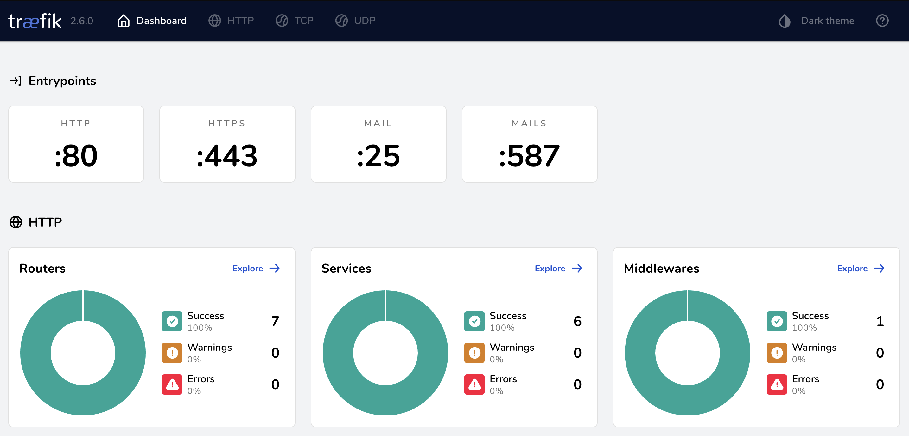

- [Docker Desktop](#docker-desktop)
  - [Installation](#installation)
  - [Alternatives](#alternatives)
- [Global Services Setup](#global-services-setup)
- [Service Descriptions](#service-descriptions)
  - [CoreDNS](#coredns)
  - [StepCA](#stepca)
  - [Traefik](#traefik)
  - [MailHog](#mailhog)
- [Core Services Setup](#core-services-setup)
  - [Set up services directories and configs](#set-up-services-directories-and-configs)
  - [Seed Step CA](#seed-step-ca)
  - [Start the Core Services](#start-the-core-services)
- [DNSMasq (Optional)](#dnsmasq-optional)
  - [Windows Support](#windows-support)
  - [MacOS Installation](#macos-installation)
- [Mutagen (MacOS)](#mutagen-macos)
- [Mutagen-Compose](#mutagen-compose)
  - [Installation (MacOS)](#installation-macos)

## Docker Desktop

Grab the latest version from [docker.com](http://docker.com) and install it.
You can configure the general resource limits in Windows and MacOS for the
shadow VM that Docker needs to run. If you still plan to use your device for
other work you shouldn't allocate more than 50% of your memory and CPU to the
shadow VM.

### Installation

1. Run the downloaded installer
1. Start Docker Desktop if it isn't already running
1. Configure Docker settings
   1. Click the Cog icon in the top right
      1. Ensure `Use gRPC FUSE for file sharing` is enabled
      1. Ensure `Use Docker Compose V2` is enabled
   1. Under `Resources` tab:
      1. Under `Advanced`:
         1. Set maximum number of CPUs allowed to at most 1/2 of your Mac's CPU
         core count
            - Example: 16-core Intel should have no more than 8 set as the max
         1. Set maximum memory to at most 1/2 of your Mac's memory
            - Example: 16GB Mac should have no more than 8 set as the max
      1. Under `File Sharing`:
         1. Make sure `/Users` or the folder container all your projects is
         shared
      1. Under `Network` (Optional):
         1. Adjust the Docker subnet
   1. Click `Apply & Restart` to apply your changes

### Alternatives

Docker Desktop is not free for everyone, so it may not be a fit for you or your
organization. You do not need to use Docker Desktop for this. This is intended
for use with Docker, so any Docker service will work (e.g. Lima or Colima).

## Global Services Setup

The global project services are a set of containers that every project will
share. These provide general services that don't need to be customized on a
per-project basis and simplify the DevEnv. These services are meant to run
separately from any individual project and to be kept running at all times.

## Service Descriptions

### CoreDNS

This provides internal DNS for StepCA and Traefik to aide in generating SSL
certificates for projects.

### StepCA

This is the actual CA that will be used to issue SSL certificates. It will
house and maintain the root CA certificate and sign and issue all requested
certificates. Failure to initialize the CA, as outlined in the installation
instructions below, may result in incorrect certificates.

### Traefik

This is the powerhouse of the DevEnv. It is a reverse-proxy that will handle
all incoming requests and route them to the correct Docker containers. This
will also handle the automatic request for new SSLs and the periodic upkeep
of requesting renewals.

### MailHog

This is a tool to trap mail from Docker containers and to provide a Web
interface to preview / read the emails. The data is ephemeral so if you want
to save an email, screenshot it.

## Core Services Setup

### Set up services directories and configs

All the services listed above will be contained in their own
`docker-compose.yml` file and started as one project.

1. Create a global network for containers to attach to:
   ```
   docker network create \
     --internal \
     --subnet=172.19.0.0/16 \
     --gateway=172.19.0.1 \
     --ip-range=172.19.128.0/17 \
     traefik-backbone
   ```
1. Create a global services project folder and `cd` into it:
   ```
   mkdir ~/global-services && cd ~/global-services
   ```
1. Create a directory for each service to hold configs and cache files:
   ```
   mkdir -p traefik/traefik.d step-ca coredns/zones.d
   ```
1. Create CoreDNS configuration file<br>
   **coredns/Corefile**
   ```
   . {
     auto {
       # Automatically load all zone files in the directory "/zones.d"
       directory /zones.d db\.(.*) {1}
       # Check to see if the zone files need to be reloaded every 20 seconds
       reload 20s
     }
     # Will forward requests that aren't handled by one of the configured
     # zones to Cloudflare DNS
     forward . 1.1.1.1:53 1.0.0.1:53
     errors
     log
     # Will automatically reload
     reload
   }
   ```
1. Download the [coredns-acme-dns01-linux-amd64](files/coredns-acme-dns01-linux-amd64) helper tool to
   automatically create and update zone files, place it in the `traefik` directory.
1. Update permissions to allow execution of the downloaded file
   ```
   chmod +x traefik/coredns-acme-dns01-linux-amd64
   ```
1. Create `traefik/traefik.yml` configuration file.
   ```
   global:
     checkNewVersion: true
     sendAnonymousUsage: false
   
   api:
     dashboard: true
     debug: false
   
   pilot:
     dashboard: false
     
   docker:
     domain: lan
   
   providers:
     docker:
       defaultRule: "Host(`{{ normalize .Name }}.lan`)"
       endpoint: "unix:///var/run/docker.sock"
       exposedByDefault: false
       network: traefik-backbone
     file:
       directory: "/traefik/traefik.d"
       watch: true
    
   entrypoints:
     http:
       address: ":80"
       forwardedHeaders:
         insecure: true
       # Force all HTTP requests to HTTPS
       http:
         redirections:
           entryPoint:
             scheme: https
             to: https
     https:
       address: ":443"
       forwardedHeaders:
         insecure: true
       http:
         middlewares:
           compress: true
         tls:
           certResolver: stepCA
     mail:
       address: ":25"
     mails:
       address: ":587"
   
   tls:
     minVersion: VersionTLS12
   
   serversTransport:
     insecureSkipVerify: true
   
   certificatesResolvers:
     stepCA:
       acme:
         # Use the internal StepCA server
         caServer: "https://step-ca:9000/acme/acme/directory"
         # Certificates valid for 90 days (2160 hours)
         certificatesDuration: 2160
         email: "acme@devenv.lan"
         storage: /traefik/acme.json
         keyType: "EC384"
         dnsChallenge:
           provider: exec
           delayBeforeCheck: 25
           resolvers:
             - "172.19.0.53:53"
   ```
1. Create `traefik/acme.json` with empty JSON object
   ```
   {}
   ```
1. Adjust permissions for `traefik/acme.json`
   ```
   chmod 600 traefik/acme.json
   ```
1. Create a docker-compose.yml file detailing all the configurations for the
core service containers:
   **docker-compose.yml**
   ```yml
   networks:
     # Use the network we already created
     traefik-backbone:
       # This specifies that the network was created outside this compose file
       external: true
    
   services:
     # Traefik reverse-proxy container
     traefik:
       image: traefik:latest
       container_name: traefik
       restart: unless-stopped
       depends_on:
         - coredns
         - mailhog
         - step-ca
       networks:
         - default
         - traefik-backbone
       # Force Traefik to use CoreDNS
       dns:
         - 172.19.0.53
       # Expose these ports to the host
       ports:
         - "80:80"   # Allow HTTP traffic
         - "443:443" # Allow HTTPS traffic
         - "25:25"   # Allow SMTP traffic
         - "587:587" # Allow SMTP (alt port) traffic
       volumes:
         # This exposes the docker socket so Traefik can read running container
         # configurations for automatic registration
         - /var/run/docker.sock:/var/run/docker.sock
         # Share the generated certs and private key files from StepCA
         - ${PWD}/step-ca/certs/:/etc/step-ca/certs
         - ${PWD}/step-ca/secrets:/etc/step-ca/private
         # Add the custom ACME script for Traefik to execute
         - ${PWD}/traefik/coredns-acme-dns01-linux-amd64/:/usr/local/bin/coredns-acme-dns01-linux-amd64
         # Share the CoreDNS zones so Traefik can dynamically create/update them
         - ${PWD}/coredns/zones.d/:/coredns/zones.d/
         # Share the custom Traefik configuration
         - ${PWD}/traefik/traefik.yml:/etc/traefik/traefik.yml
         - ${PWD}/traefik/traefik.d:/traefik/traefik.d
         # Share the custom acme.json where issued certs are stored
         - ${PWD}/traefik/acme.json:/traefik/acme.json
       environment:
         LEGO_CA_CERTIFICATES: /etc/step-ca/certs/root_ca.crt
         EXEC_PATH: /usr/local/bin/coredns-acme-dns01-linux-amd64
       labels:
         traefik.enable: true
         traefik.docker.network: traefik-backbone
         traefik.http.routers.traefik-dashboard.entrypoints: http,https
         traefik.http.routers.traefik-dashboard.rule: "Host(`traefik.lan`)"
         traefik.http.routers.traefik-dashboard.tls: true
         traefik.http.routers.traefik-dashboard.tls.certresolver: stepCA
         traefik.http.routers.traefik-dashboard.tls.domains[0].main: "traefik.lan"
         traefik.http.routers.traefik-dashboard.service: "api@internal"
      
     coredns:
       image: coredns/coredns:1.8.7
       container_name: coredns
       restart: unless-stopped
       networks:
         traefik-backbone:
           # Specify a specific IP address for this container, 53 for DNS
           ipv4_address: 172.19.0.53
         default: {}
       volumes:
         # Share local configuration files
         - ${PWD}/coredns/Corefile:/Corefile
         - ${PWD}/coredns/zones.d/:/zones.d/
    
     mailhog:
       image: mailhog/mailhog:v1.0.1
       container_name: mailhog
       networks:
         - traefik-backbone
       restart: unless-stopped
       labels:
         traefik.enable: true
         traefik.docker.network: traefik-backbone
         traefik.http.routers.traefik-mailhog.entrypoints: http,https
         traefik.http.routers.traefik-mailhog.rule: Host(`mailhog.lan`)
         traefik.http.routers.traefik-mailhog.tls: true
         traefik.http.routers.traefik-mailhog.tls.certresolver: stepCA
         traefik.http.routers.traefik-mailhog.tls.domains[0].main: "mailhog.lan"
         traefik.http.routers.traefik-mailhog.service: mailhog
         traefik.http.services.mailhog.loadbalancer.server.port: 8025
         traefik.http.services.mailhog.loadbalancer.server.scheme: http
         ## This will allow other services on the Mac to route
         ## mail to 127.0.0.1:1025 and have the emails show in Mailhog
         ##
         # traefik.tcp.routers.traefik-mailhog-mail.rule: "HostSNI(`*`)"
         # traefik.tcp.routers.traefik-mailhog-mail.entrypoints: mail
         # traefik.tcp.routers.traefik-mailhog-mail.service: traefik-mailhog-mail
         # traefik.tcp.services.traefik-mailhog-mail.loadbalancer.server.port:    1025
      
     step-ca:
       image: smallstep/step-ca
       container_name: step-ca
       volumes:
         # Share StepCA configuration files
         - ${PWD}/step-ca/:/home/step/
       networks:
         traefik-backbone:
           ipv4_address: 172.19.4.43
           aliases:
             - step-ca
       restart: unless-stopped
       environment:
         DOCKER_STEPCA_INIT_NAME: Classy Llama DevEnv
         DOCKER_STEPCA_INIT_DNS_NAMES: localhost,step-ca
         DOCKER_STEPCA_INIT_PROVISIONER_NAME: devenv@devenv.lan
       # Override initial command to use specific DNS resolver
       command: /bin/sh -c "exec /usr/local/bin/step-ca --password-file /home/step/secrets/password --resolver '172.19.0.53:53' /home/step/config/ca.json"
   ```

### Seed Step CA

1. Move into the global services directory created in step 2 of "Generic
   Service Setup" if you are not already there<br>
   ```
   cd ~/global-services
   ```
1. Start just the StepCA container
   ```
   docker compose up -d step-ca
   ```
1. Looking at the output for this docker container you should see the following after proper initialization:
   ```
   ✔ Root certificate: /home/step/certs/root_ca.crt
   ✔ Root private key: /home/step/secrets/root_ca_key
   ✔ Root fingerprint: 7e0a73f175342a088b8ff630cb20e847e2a8d26f6033359300af2aef73530d27
   ✔ Intermediate certificate: /home/step/certs/intermediate_ca.crt
   ✔ Intermediate private key: /home/step/secrets/intermediate_ca_key
   ✔ Database folder: /home/step/db
   ✔ Default configuration: /home/step/config/defaults.json
   ✔ Certificate Authority configuration: /home/step/config/ca.json

   Your PKI is ready to go. To generate certificates for individual services see 'step help ca'.
   ```
1. Check that you can see the following files on your host system. If not stop the container and empty the `step-ca` folder and retry
   - step-ca/certs/root_ca.crt
   - step-ca/certs/intermedia_ca.crt
   - step-ca/config/ca.json
   - step-ca/config/defaults.json
   - step-ca/secrets/root_ca_key
   - step-ca/secrets/intermedia_ca_key
1. Add the ACME provisioner to StepCA
   ```
   docker compose exec step-ca step ca provisioner add acme --type ACME
   ```
   - You should see the following if successful:
     ```
     Success! Your `step-ca` config has been updated. [...]
     ```
1. Stop the StepCA container
   ```
   docker compose down step-ca
   ```
1. Import the root CA certificate (located at `step-ca/certs/root_ca.crt`) into the Mac keychain,
   or Windows trust, and any browsers that don't read their CA certificates from the Mac keychain,
   or Windows trust.

### Start the Core Services

1. Move into the global services directory created in step 2 of "Generic
   Service Setup"<br>
   ```
   cd ~/global-services
   ```
1. Start the containers:
   ```
   docker compose up -d
   ```
1. Confirm Traefik is up and running
   1. Try navigating to [https://traefik.lan/](https://traefik.lan/) and you
      should be presented with the Traefik dashboard.<br>
      > If you encounter SSL errors, wait a minute or two for Step CA to issue
      > the SSL certificate, then refresh.<br>

      

## DNSMasq (Optional)

If you want to work offline or use a custom TLD (e.g. .lan or .devenv) this
will allow you to route any domain to a specific IP. It will only resolve what
it has authority to resolve and will pass along all other requests to a real
DNS server.

### Windows Support

Unfortunately Windows is not supported by DNSMasq. You can use any other DNS
proxy system (e.g. firewall) or potentially use the CoreDNS container as the DNS
provider for your system. This is outside the scope of this document.

### MacOS Installation

1. Install the DNSMasq package
    - `brew install dnsmasq `
2. Add record to forward all requests for `.lan` addresses to DNSMasq
    - `echo "address=/.lan/127.0.0.1" | sudo tee -a /opt/homebrew/etc/dnsmasq.conf`
3. Add custom resolver for `.lan`
    - Create the resolver directory (if it doesn't already exist):
    `sudo mkdir /etc/resolver`
    - Add DNSMasq as the resolver for `.lan`:
    `echo "nameserver 127.0.0.1" | sudo tee /etc/resolver/lan`
4. Restart MacOS Resolver
   ```
   sudo killall -HUP mDNSResponder;
   sudo killall mDNSResponderHelper;
   sudo dscacheutil -flushcache
   ```
5. Validate the resolver is now able to use DNSMasq:
   `scutil --dns | grep -A3 -B1 lan`
    - You should expect to see something like the following:
      ```
      resolver #8
         domain   : lan
         nameserver[0] : 127.0.0.1
         flags    : Request A records, Request AAAA records
         reach    : 0x00030002 (Reachable,Local Address,Directly Reachable Address)
      ```

## Mutagen (MacOS)

Install mutagen via Homebrew like any other package: `brew install mutagen-io/mutagen/mutagen`

Once installed you can use the sample file as a guide on how to configure this
project.

## Mutagen-Compose

Mutagen-Compose is a docker-compose replacement that will start a separate
container process to keep files inside a docker volume and on the host in sync.
There are some caveats to this which require some initial workflow adjustments.

### Installation (MacOS)

Install mutagen-compose via Homebrew: `brew install mutagen-io/mutagen/mutagen-compose`
